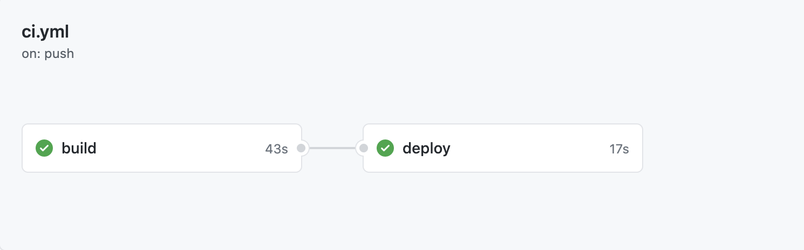

### Sample Pact provider service

The sample Pact provider service based on Spring Boot with contract testing CI/CD pipeline based on GitHub Actions.

This repository implements the contract testing pipeline following [the general documentation](https://docs.pact.io/pact_nirvana/step_4/#provider-pipeline).


On merge to any branch it triggers [the GitHub Actions pipeline](https://github.com/artemptushkin/heisenberg-pact-service/actions)
that includes steps:
1. Build
2. Test
3. Publish verification result into Pact Broker
4. [Can-i-deploy](https://docs.pact.io/pact_broker/can_i_deploy/)
5. Dummy deploy step
6. [Create-version-tag](https://github.com/pact-foundation/pact_broker-client#create-version-tag)

See [pipeline](.github/workflows) for more

### Tags strategy

1. It publishes tag equal to an environment after the actual deployment to an env, i.e. `test, prod`
2. It fetches pacts by the next tags to run tests against it: (the set of pacts is different then consumers one!)
* locally: `develop`
* CI/CD pipeline: `{GIT_BRANCH}, test, prod`
3. It uses versions for Pact broker:
* locally: from maven
* CI/CD pipeline: first 6 letters of a git commit hash

### Use case provider scenarios

### scenario-1

Jessy-pinkman as consumer expects that Heisenberg on GET request to `/heisenberg/v1/crystalls` will respond with body:

```json
{
    "amount": 20,
    "crystals": [
        {
            "color": "red",
            "id": 1
        },
        {
            "color": "blue",
            "id": 2
        }
    ]
}
```

1. Consumer opens [pull request](https://github.com/artemptushkin/jesse-pinkman-pact-service/pull/2)

2. CI pipeline fails


    1. :white_check_mark: assemble: `./mvnw clean package` :white_check_mark:
    2. :white_check_mark: test: `./mvnw pact:publish -Dpact.consumer.tags=refs/pull/2/merge -Dpact.consumer.version=fe388ea8` :white_check_mark:
    3. :x: `can-i-deploy` fails due to absent of pact verification on the provider side:
      

3. Provider opens [pull request](https://github.com/artemptushkin/heisenberg-pact-service/pull/1)
with code updates to meet Jessy-pinkman's expectations

4. Provider pipeline is green

  
    1. :white_check_mark: build:
  
          ```bash
            ./mvnw clean package \
                 -Dpactbroker.consumerversionselectors.tags=scenario/1-consumer-first \
                 -Dpact.provider.tag=refs/pull/1/merge \
                 -Dpact.verifier.publishResults=true \
                 -Dpact.provider.version=c474f134
          ```
    2. :white_check_mark: `can-i-deploy`:
   
    3. :white_check_mark: tagging before deployment to `test` 
   

5. Provide merges to master and deploys to production
6. Consumer reruns pipeline without any code updates
7. Consumer merges to master and deploys to production

#### scenario-2

Heisenberg as provider goes breaking bad and break backward compatibility with Jessy-pinkman.

Branch: https://github.com/artemptushkin/heisenberg-pact-service/tree/1-provider-breaks-backward-compatibility

1. Jessy-pinkman expects this body in response on [prod](https://hello.pactflow.io/pacts/provider/heisenberg/consumer/jesse-pinkman/version/6321fdef)
```json
{
    "amount": 20,
    "crystals": [
        {
            "color": "red",
            "id": 1
        },
        {
            "color": "blue",
            "id": 2
        }
    ]
}
```
Namely, one `red` and one `blue` crystals

2. Heisenberg changes code to send `green` instead of `red` crystal and opens [pull request](https://github.com/artemptushkin/heisenberg-pact-service/pull/2)

3. :x: Build fails as a pact is violated
    1. build:
          ```bash
            ./mvnw clean package \
                 -Dpactbroker.consumerversionselectors.tags=$GIT_BRANCH,test,prod \
                 -Dpact.provider.tag=1-provider-breaks-backward-compatibility \
                 -Dpact.verifier.publishResults=true \
                 -Dpact.provider.version=91010641
          ```
    
    fails on:
    
        1) Verifying a pact between jesse-pinkman and heisenberg - GET REQUEST
        
            1.1) BodyMismatch: $.crystals.0.color BodyMismatch: $.crystals.0.color Expected 'red' (String) but received 'green' (String)

#### scenario-3

Heisenberg as provider verified not all the pacts he is expected to.